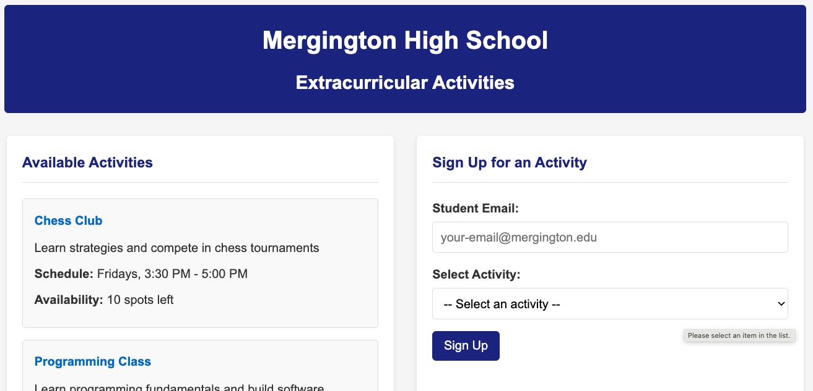

## Step 1: Copilot 시작하기

**Getting Started with GitHub Copilot** 실습에 오신 것을 환영합니다! :robot:

이번 실습에서는 GitHub Copilot의 다양한 기능을 사용해, Mergington High School 학생들이 방과후 활동을 신청할 수 있는 웹사이트를 개선합니다. 🎻 ⚽️ ♟️



### 📖 이론: GitHub Copilot 알아보기


GitHub Copilot은 더 빠르고 적은 노력으로 코드를 작성할 수 있도록 도와주는 AI 코딩 도우미입니다. 덕분에 문제 해결과 협업에 더 집중할 수 있습니다.

GitHub Copilot은 개발자 생산성을 높이고 소프트웨어 개발 속도를 향상시키는 데 효과가 있음이 입증되었습니다. 자세한 내용은 [GitHub 블로그 연구 글](https://github.blog/news-insights/research/research-quantifying-github-copilots-impact-on-developer-productivity-and-happiness/)을 참고하세요.

IDE에서 작업할 때 가장 자주 사용하게 될 상호작용 방식은 다음과 같습니다.

| 상호작용 모드 | 📝 설명 | 🎯 적합한 용도 |
| ------------------------- | ------------------------------------------------------------------------------------------------------------------------------ | --------------------------------------------------------------------------------------------------------------- |
| **⚡ Inline suggestions** | 입력 중에 나타나는 AI 코드 제안으로, 한 줄부터 함수 단위까지 문맥 기반 완성을 제공합니다. | 현재 줄을 빠르게 완성하거나 코드 블록을 생성할 때 |
| **💭 Inline Chat**        | 현재 파일 또는 선택 영역에 범위가 제한된 대화형 채팅입니다. 특정 코드 블록에 대해 질문할 수 있습니다. | 코드 설명, 특정 함수 디버깅, 국소 개선 |
| **💬 Ask Mode**           | 코드베이스, 코딩, 일반 기술 개념 관련 질문 응답에 최적화되어 있습니다. | 코드 이해, 아이디어 브레인스토밍, 질의응답 |
| **🤖 Agent Mode**         | 대부분의 코딩 작업에 권장되는 기본 모드로, 작업 완료까지 자율 편집/도구 사용/후속 처리를 수행합니다. | 일상적인 코딩 작업부터 다중 파일 구현 작업까지 |
| **🧭 Plan Agent**         | 코드 변경 전 계획 수립과 명확화 질문에 최적화되어 있습니다. | 먼저 계획을 검토한 뒤 구현으로 넘기고 싶을 때 |

실습을 진행하다 보면 GitHub Copilot이 github.com 웹사이트는 물론 VS Code, JetBrains, Xcode 같은 다양한 개발 환경에서 도움을 줄 수 있음을 확인할 수 있습니다.

이번 실습에서는 [GitHub Codespaces](https://github.com/features/codespaces)라는 사전 구성된 개발 환경에서 VS Code를 사용해 진행합니다.

> 🪧 **참고:** 아래 단계의 버튼/메뉴 이름은 영문 UI 기준입니다. VS Code를 한국어 UI로 사용 중이면 의미가 같은 메뉴를 선택하세요.

> [!TIP]
> 현재 및 예정된 기능은 [GitHub Copilot Features](https://docs.github.com/en/copilot/about-github-copilot/github-copilot-features) 문서에서 확인할 수 있습니다.

### :keyboard: 활동: Copilot Chat으로 프로젝트 소개 받기

개발 환경을 시작하고 Copilot으로 프로젝트를 간단히 파악한 뒤, 실제로 실행해 봅시다.

1. 아래 버튼을 눌러 새 탭에서 **Create Codespace** 페이지를 엽니다. (GitHub 제품 명칭은 Codespaces입니다.) 기본 설정을 그대로 사용하세요.

   [](https://codespaces.new/{{full_repo_name}}?quickstart=1)

1. **Repository** 항목이 원본이 아닌 내 실습 복제본인지 확인한 후, 초록색 **Create Codespace** 버튼을 클릭하세요.
   - ✅ 내 복제본: `/{{full_repo_name}}`
   - ❌ 원본: `/hahaysh/getting-started-with-github-copilot` (한글화 템플릿 리포지토리)

1. 브라우저에서 Visual Studio Code가 로드될 때까지 잠시 기다립니다.

1. 왼쪽 사이드바에서 Extensions 탭을 열고, `GitHub Copilot` 및 `Python` 확장이 설치 및 활성화되어 있는지 확인합니다.

   

   

1. VS Code 상단에서 **Toggle Chat 아이콘**을 눌러 Copilot Chat 사이드 패널을 엽니다.

   

   > 🪧 **참고:** GitHub Copilot을 처음 사용한다면, 진행 전에 이용 약관 동의가 필요합니다.

1. 첫 번째 상호작용을 위해 **Ask Mode**로 전환되어 있는지 확인하세요.

   

1. 아래 프롬프트를 입력해 Copilot에게 프로젝트 소개를 요청합니다.

   > 🪧 **참고:** 실습 재현성을 위해 아래 영어 프롬프트를 **그대로 복사**해 사용하세요.
   > 의미: 프로젝트 구조를 간단히 설명하고 실행 방법을 물어봅니다.

   > 
   >
   > ```prompt
   > Please briefly explain the structure of this project.
   > What should I do to run it?
   > ```

   > 🪧 **참고:** Copilot이 제안하는 실행 절차를 그대로 따를 필요는 없습니다. 실습 환경은 이미 준비되어 있습니다.

1. 이제 프로젝트를 직접 실행해 봅시다. 왼쪽 사이드바에서 `Run and Debug` 탭을 선택한 뒤 **Start Debugging** 아이콘을 누르세요.

   

1. 브라우저에서 웹페이지를 보기 위해 URL과 포트를 확인합니다. 보이지 않으면 하단 패널을 펼쳐 **Ports** 탭을 선택하세요.

1. 목록에서 포트 `8000`과 해당 링크를 찾고, 링크에 마우스를 올린 뒤 **Open in browser** 아이콘을 선택합니다.

   

### :keyboard: 활동: Copilot으로 터미널 명령 기억하기 🙋

잘하셨습니다. 앱이 정상 동작하는 것도 확인했으니, 이제 커스터마이징을 위해 브랜치를 만드는 작업을 Copilot 도움으로 진행해 봅시다.

1. VS Code 하단 패널에서 **Terminal** 탭을 선택하고, 오른쪽의 `+` 버튼을 눌러 새 터미널 창을 엽니다.

   > 🪧 **참고:** 이렇게 하면 현재 웹 애플리케이션을 호스팅 중인 디버그 세션을 중단하지 않을 수 있습니다.

1. 새 터미널 창에서 `Ctrl + I`(Windows) 또는 `Cmd + I`(macOS) 단축키로 **Copilot Terminal Inline Chat**을 엽니다.

1. Copilot에게 브랜치 생성 및 게시 명령을 물어봅니다.

   > 🪧 **참고:** 실습 재현성을 위해 아래 영어 프롬프트를 **그대로 복사**해 사용하세요.
   > 의미: `accelerate-with-copilot` 브랜치를 생성하고 원격에 게시하는 방법을 묻습니다.

   > 
   >
   > ```prompt
   > Hey copilot, how can I create and publish a new Git branch called "accelerate-with-copilot"?
   > ```

   > 💡 **팁:** 원하는 답변이 아니어도 추가로 설명하면 됩니다. Copilot은 이전 대화 내용을 기억해 후속 응답에 반영합니다.

1. `Run` 버튼을 눌러 Copilot이 터미널 명령을 직접 삽입하게 하세요. 복사/붙여넣기할 필요가 없습니다.

1. 잠시 후 VS Code 왼쪽 하단 상태바에서 활성 브랜치를 확인합니다. `accelerate-with-copilot`로 표시되면 이 단계는 완료입니다.

1. 브랜치를 GitHub에 푸시하면 Mona가 자동으로 작업을 검사합니다. 잠시 기다리며 코멘트를 확인하세요. 진행 상황과 다음 레슨이 안내됩니다.

<details>
<summary>문제가 있나요? 🤷</summary><br/>

피드백이 오지 않으면 아래 항목을 확인하세요.

- 브랜치 이름이 `accelerate-with-copilot`와 정확히 일치하는지 확인하세요. 접두사/접미사는 없어야 합니다.
- 해당 브랜치가 실제로 내 리포지토리에 게시되었는지 확인하세요.

</details>
