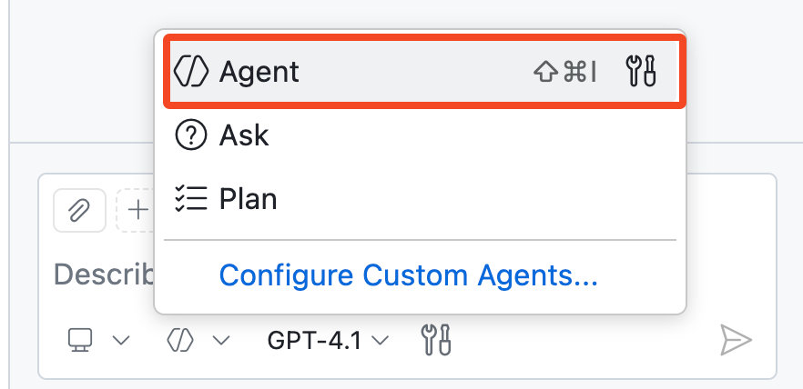
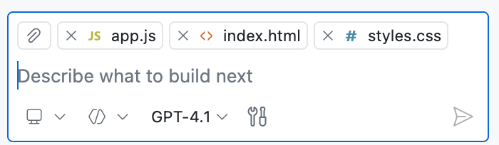
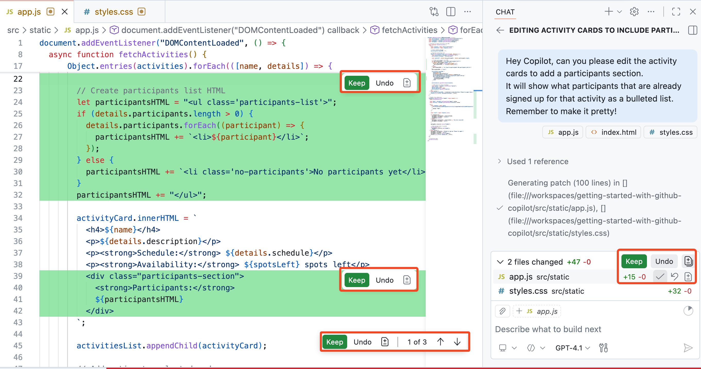
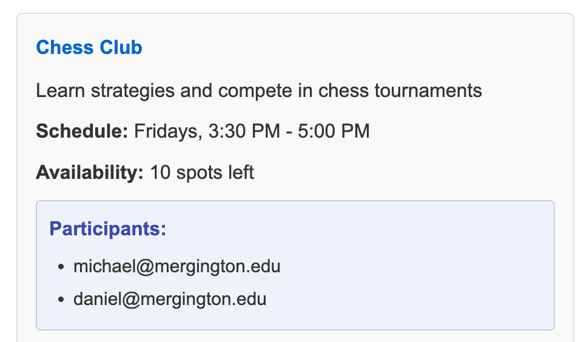

## Step 3: Hyperdrive 시작 - Copilot Agent Mode 🚀

### 📖 이론: Copilot Agent Mode란?

Copilot [agent mode](https://code.visualstudio.com/docs/copilot/chat/chat-agent-mode)는 AI 보조 코딩의 다음 단계입니다. 자율적인 페어 프로그래머처럼 동작하며, 지시에 따라 여러 단계를 거치는 코딩 작업을 수행합니다.

Copilot Agent Mode는 컴파일/린트 오류에 대응하고, 터미널 및 테스트 출력을 모니터링하며, 작업이 완료될 때까지 반복적으로 자동 수정합니다.

#### Agent Mode 한눈에 보기

| 항목 | 👩‍🚀 Agent Mode |
| --- | --- |
| 자율성 및 계획 | 상위 수준 요청을 다단계 작업으로 분해하고, 완료될 때까지 반복 수행합니다. |
| 컨텍스트 수집 | 현재 컨텍스트를 사용하고 필요 시 관련 파일을 추가 탐색합니다. |
| 도구 사용 | 도구를 자동 선택/실행하며, `#codebase` 같은 멘션으로 직접 지시할 수도 있습니다. |
| 승인 및 안전 장치 | 민감한 작업은 실행 전 승인 절차를 거쳐 제어권을 유지할 수 있습니다. |

#### 🧰 Agent Mode 도구

Agent mode는 사용자 요청을 처리하면서 특화된 작업을 수행하기 위해 도구를 사용합니다. 예시는 다음과 같습니다.

- 프롬프트 수행에 필요한 관련 파일 찾기
- 웹페이지 내용 가져오기
- 테스트 또는 터미널 명령 실행

> [!TIP]
> VS Code에는 기본 제공 도구가 많지만, **MCP tools**를 통해 Agent Mode에 도메인 특화 기능을 추가할 수도 있습니다.
>
> 자세한 내용은 [MCP servers](https://code.visualstudio.com/docs/copilot/customization/mcp-servers)와 [GitHub MCP Server](https://github.com/github/github-mcp-server)를 참고하세요.

이제 **Agent Mode**를 직접 사용해 봅시다. 👩‍🚀

### :keyboard: 활동: Copilot으로 새 기능 추가하기 :rocket:

현재 웹사이트는 활동 목록만 보여주고 참가자 목록은 숨겨져 있습니다. 🤫

Copilot을 사용해 각 활동 카드 아래에 신청한 학생 목록이 보이도록 바꿔봅시다.

1. Copilot Chat 창 하단 드롭다운에서 **Agent** 모드로 전환합니다. (한국어 UI에서는 '에이전트' 또는 '대리인' 모드로 표시될 수 있습니다.)

   

1. 웹페이지 관련 파일을 열고 각 에디터 창(또는 파일)을 채팅 패널로 드래그해 컨텍스트로 추가합니다.

   - `src/static/app.js`
   - `src/static/index.html`
   - `src/static/styles.css`

   > 🪧 **참고:** 파일 컨텍스트 추가는 선택 사항입니다. 생략해도 Copilot Agent Mode는 `#codebase` 등 도구로 관련 파일을 찾을 수 있습니다. 다만 대규모 코드베이스에서는 특정 파일을 추가해 주는 것이 더 효과적입니다.

   

   > 💡 **팁:** **Add Context...** 버튼을 이용해 GitHub 이슈나 터미널 출력 등 다른 컨텍스트도 추가할 수 있습니다.

1. Copilot에게 활동별 현재 참가자 표시 기능을 추가해 달라고 요청합니다. 편집 제안이 생성되고 적용될 때까지 잠시 기다립니다.

   > 🪧 **참고:** 실습 재현성을 위해 아래 영어 프롬프트를 **그대로 복사**해 사용하세요.
   > 의미: 활동 카드에 참가자 목록(불릿 리스트)을 보기 좋게 추가해 달라는 요청입니다.

   > 
   >
   > ```prompt
   > Hey Copilot, can you please edit the activity cards to add a participants section.
   > It will show what participants that are already signed up for that activity as a bulleted list.
   > Remember to make it pretty!
   > ```

   Copilot 작업이 끝나면 어떤 변경을 유지할지 사용자가 최종 결정합니다.

   아래 **Keep** 버튼으로 전체 수락/폐기 또는 변경별 선택 적용이 가능합니다. 채팅 패널이나 각 수정 파일에서 모두 수행할 수 있습니다.

      


1. 변경을 바로 수락하기 전에 웹사이트를 다시 확인해 의도대로 업데이트되었는지 검증하세요.
   
   아래는 업데이트된 활동 카드 예시입니다. 앱 재시작이나 페이지 새로고침이 필요할 수 있습니다.

   

   > 🪧 **참고:** 활동 카드 모양은 다를 수 있습니다. Copilot 결과는 항상 동일하지 않습니다.

   <details>
   <summary>도움이 필요하신가요? 🤷</summary><br/>
   웹사이트가 로드되지 않으면 아래를 확인하세요.

   - VS Code Debugger를 재시작해 최신 버전이 서빙되도록 합니다.
   - URL을 잊었거나 창을 닫았다면 Step 1을 다시 확인하세요.
   - 강력 새로고침(hard refresh) 또는 시크릿 창에서 열어 캐시를 우회합니다.

   </details>

1. 변경 사항이 정상임을 확인했다면 패널에서 각 제안을 검토하며 **Keep**으로 적용합니다.

   > 💡 **팁:** 변경을 바로 수락하거나 직접 수정할 수 있으며, 채팅으로 추가 지시를 내려 결과를 더 다듬을 수 있습니다.

### :keyboard: 활동: Agent mode로 참가 취소 버튼 추가하기

이번에는 좀 더 개방형 요청으로 웹 애플리케이션 기능을 확장해 보겠습니다.

원하는 결과가 나오지 않으면 다른 모델을 시도하거나 후속 피드백으로 결과를 보정해 보세요.

1. Copilot이 계속 **Agent** 모드인지 확인합니다.

   

1. **Tools** 아이콘을 눌러 현재 Copilot Agent Mode에서 사용 가능한 도구를 확인합니다.

   

1. 이제 테스트입니다. Copilot에게 참가자 제거 기능을 추가하도록 요청합니다.

   > 🪧 **참고:** 실습 재현성을 위해 아래 영어 프롬프트를 **그대로 복사**해 사용하세요.
   > 의미: 참가자 옆 삭제 아이콘 추가, 불릿 숨김, 클릭 시 참가 취소 기능을 요청합니다.

   > 
   >
   > ```prompt
   > #codebase Please add a delete icon next to each participant and hide the bullet points.
   > When clicked, it will unregister that participant from the activity.
   > ```

   `#codebase` 도구는 현재 작업과 관련된 파일/코드 조각을 찾는 데 사용됩니다.

   > 🪧 **참고:** 이 실습에서는 재현성을 높이기 위해 `#codebase`를 명시적으로 사용합니다.
   > `#codebase` 없이도 시도해 보고, Agent Mode가 스스로 더 넓은 컨텍스트를 수집하는지 확인해 보세요.

1. Copilot 작업이 끝나면 코드 변경과 웹사이트 결과를 확인하세요. 결과가 괜찮다면 **Keep**을 누르고, 아니라면 피드백으로 개선합니다.

   > 🪧 **참고:** 웹사이트에 변화가 보이지 않으면 디버거 재시작이 필요할 수 있습니다.

1. Copilot에게 등록 관련 버그 수정을 요청합니다.

   > 🪧 **참고:** 실습 재현성을 위해 아래 영어 프롬프트를 **그대로 복사**해 사용하세요.
   > 의미: 참가자 등록 후 새로고침해야 반영되는 버그를 수정해 달라는 요청입니다.

   > 💡 **팁:** 등록 흐름을 직접 테스트해 수정 전/후 동작 차이를 확인하는 것을 권장합니다.

   > 
   >
   > ```prompt
   > I've noticed there seems to be a bug.
   > When a participant is registered, the page must be refreshed to see the change on the activity.
   > ```

1. Copilot 완료 후 결과를 검토하고 웹사이트에서 등록 흐름을 검증합니다.

   결과가 마음에 들면 **Keep**을 누르고, 아니라면 추가 피드백을 제공하세요.

1. 모든 변경을 `accelerate-with-copilot` 브랜치에 **commit**하고 **push**합니다.

1. Mona가 작업을 검사하고 다음 단계를 안내할 때까지 기다립니다.