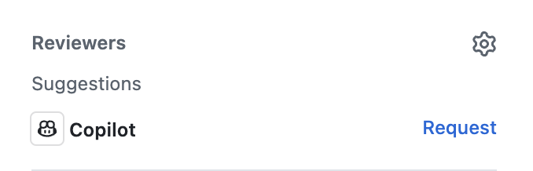

## Step 5: Pull Request에서 GitHub Copilot 활용하기

축하합니다! 이번 실습의 코딩 단계(VS Code 작업 포함)가 완료되었습니다. 이제 작업을 병합할 시간입니다. :tada: 마무리로, Pull Request 속도를 높여주는 Copilot의 제한 접근 기능 2가지를 알아봅시다.

### 📖 이론: Pull Request를 위한 GitHub Copilot

#### Copilot Pull Request 요약

일반적으로는 노트와 커밋 메시지를 검토해 Pull Request 설명을 직접 작성합니다. 커밋 메시지가 일관되지 않거나 코드 문서화가 부족하면 시간이 더 걸릴 수 있습니다. Copilot은 PR의 전체 변경사항을 분석해 핵심 요약과 참고 링크를 제시해 줄 수 있습니다.

#### Copilot 코드 리뷰

코드에는 많은 눈이 도움이 됩니다. 일반적인 동료 리뷰 전에 Copilot에게 1차 점검을 맡겨봅시다. Copilot은 간단한 수정으로 해결 가능한 흔한 실수를 잘 찾아주지만, 항상 책임감 있게 활용해야 합니다.

> [!NOTE]
> 이 기능들은 **GitHub Copilot** 유료 플랜에서만 사용할 수 있습니다. [[docs]](https://docs.github.com/en/copilot/get-started/plans)

### :keyboard: 활동: Copilot으로 PR 요약 및 리뷰하기

**Copilot pull request summaries**와 **Copilot code review**는 접근 권한이 제한될 수 있으므로, 이 활동은 대부분 선택 사항입니다. 권한이 없다면 선택 단계를 건너뛰어도 됩니다.

1. 웹 브라우저에서 새 탭을 열고 내 실습 리포지토리로 이동합니다.

1. 새 Pull Request 생성을 안내하는 **notification banner**가 보일 수 있습니다. 해당 배너를 클릭하거나 상단의 **Pull Requests** 탭에서 **create a new pull request**를 선택하세요. 아래 설정을 사용합니다.

   - **base:** `main`
   - **compare:** `accelerate-with-copilot`
   - **title:** `Improve student activity registration system`

1. (선택) PR 설명 툴바에서 **Copilot** 아이콘의 **Summary**를 클릭합니다. 잠시 후 Copilot이 변경사항 기반으로 설명을 생성합니다. :memo:

   

1. (선택) 우측 상단 정보 패널의 **Reviewers** 섹션에서 **Copilot 아이콘** 옆 **Request** 버튼을 누릅니다. 잠시 후 Copilot 리뷰 코멘트가 PR에 추가됩니다.

   

   > 💡 **팁:** Copilot 리뷰 요청 로그가 남는 것을 확인해 보세요.

1. 하단의 **Merge pull request** 버튼을 누릅니다. 수고하셨습니다. 이제 완료입니다! :tada:

1. Mona가 작업을 검사하고 피드백 및 최종 리뷰를 남길 때까지 잠시 기다립니다.
